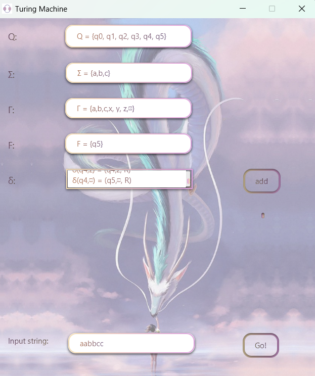
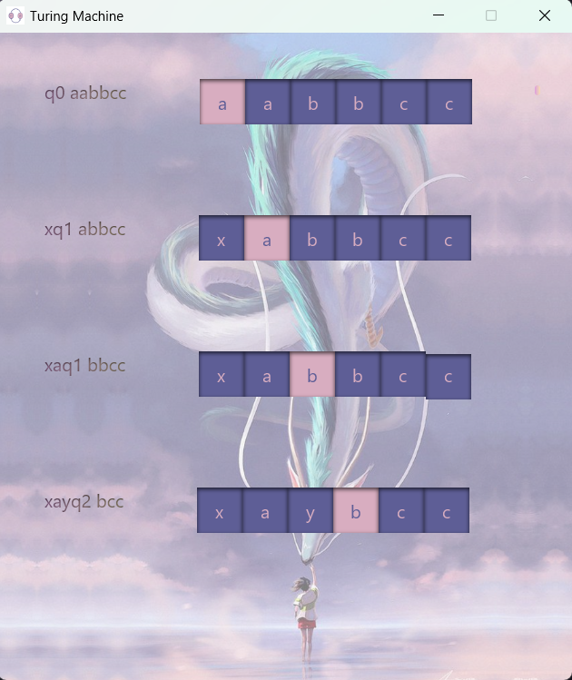

# Turing Machine Simulator (JavaFX Project)

## About
This project implements a Turing machine simulator using JavaFX. It allows users to define a Turing machine with specific states and transitions, and visualize the process of accepting or rejecting input strings. This project was developed as the final project for the **Finite Languages and Automata** course, under the supervision of **Dr. Saeid Abrishami** [Webpage](https://profsite.um.ac.ir/~s-abrishami/).

## Features
- **Graphical User Interface**: A user-friendly GUI built with JavaFX for interacting with the Turing machine.
- **Input Specification**: Define the components of the Turing machine:
  - States (Q)
  - Input alphabet (Σ)
  - Tape alphabet (Γ)
  - Accept states (F)
  - Transition function (δ)
- **Input Processing**: Input strings can be tested against the defined Turing machine.
- **Dynamic Visualization**: Displays the current state of the Turing machine while processing the input.

## Getting Started
1. Clone the repository to your local machine.
2. Open the project in your preferred IDE (e.g., IntelliJ IDEA).
3. Run the `Main` class to start the Turing machine simulator.

## Sample Input
Define the components of the Turing machine as follows:

- **States (Q)**:
```java
- Q = {q0, q1, q2, q3, q4, q5}
```
- **Input Alphabet (Σ)**:
```java
Σ = {a, b, c}
```
- **Tape Alphabet (Γ)**:
```java
Γ = {a, b, c, x, y, z, ⊡}
```
- **Accept States (F)**:
```java
F = {q5}
```
- **Transition Function (δ)**:
```java
δ(q0, a) = (q1, x, R)
δ(q0,y) = (q4,y, R)
δ(q1,a) = (q1,a, R)
δ(q1,y) = (q1,y, R)
δ(q1,b) = (q2,y, R)
δ(q2,b) = (q2,b, R)
δ(q2,z) = (q2,z, R)
δ(q2,c) = (q3,z, L)
δ(q3,y) = (q3,y, L)
δ(q3,z) = (q3,z, L)
δ(q3,a) = (q3,a, L)
δ(q3,b) = (q3,b, L)
δ(q3,x) = (q0,x, R)
δ(q4,y) = (q4,y, R)
δ(q4,z) = (q4,z, R)
δ(q4,⊡) = (q5,⊡, R)
```

- **Input String**: Test with strings like 
```java
aabbcc
```

## Screenshots
<p align="center">
   
   
   
</p>

## How to Use
1. Launch the application.
2. Enter the states, input alphabet, tape alphabet, accept states, and transition functions in the corresponding fields.
3. Input the string to be processed.
4. Click the "Go" button to visualize the processing of the input string by the Turing machine.

## License
This project is licensed under the MIT License. See the [LICENSE](LICENSE) file for details.
